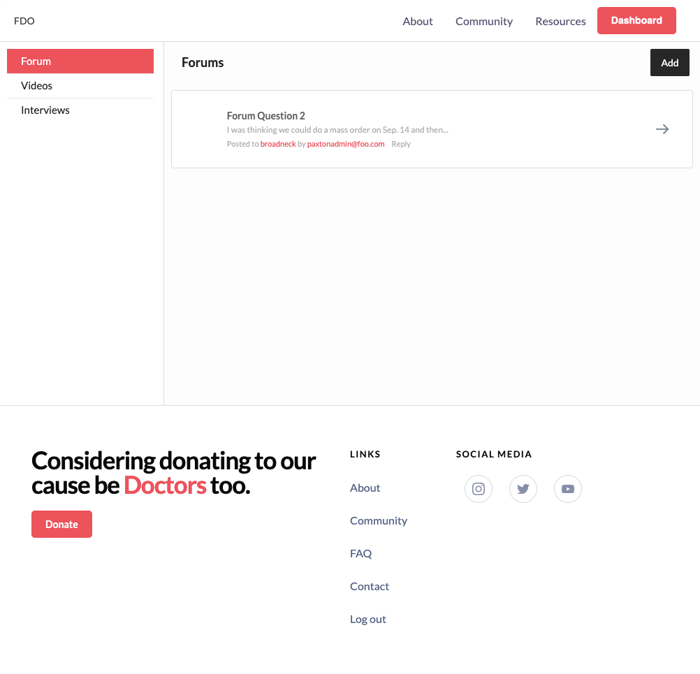
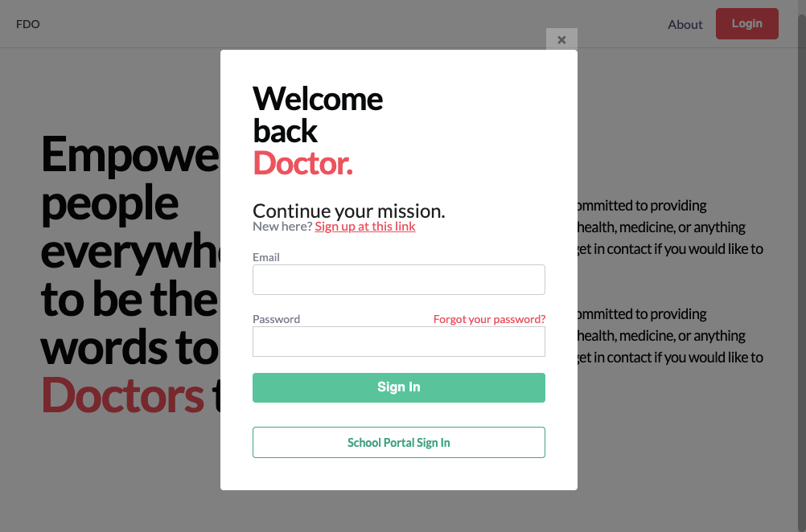

# FDOPages
Nucleus Website

Future Doctors Organization Website 

Created with Meteor, React

Install Meteor https://www.meteor.com/install 

Navigate to the root of the directory

Run "meteor npm install" 

Run "meteor npm run start" to startup of the file with some default data (can be changed by editing the file in the config directory)

Deployed temporarily at http://futuredocs.meteorapp.com/ 

